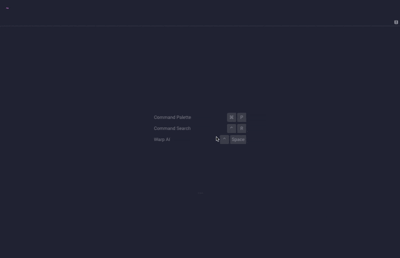

# 🌺 Hibiscus: Modern Terminal UI for AWS

<p align="center">
  
</p>

Hibiscus is a modern, terminal-based user interface (UI) that helps you interact with your AWS resources with ease. Built with a focus on simplicity and efficiency, Hibiscus provides a streamlined experience for managing your cloud infrastructure from the comfort of your terminal.

## Features

- **Intuitive Navigation**: Quickly navigate through your AWS services and resources using an intuitive, keyboard-driven interface.
- **Real-time Updates**: Stay up-to-date with the latest changes in your AWS environment, with Hibiscus continuously refreshing your view.
- **Detailed Information**: Dive into your AWS resources, including ECR and Route53, and more.
- **Seamless Integration**: Hibiscus integrates seamlessly with the AWS CLI, allowing you to leverage existing tools and scripts.
- **Responsive Design**: The UI adapts to different terminals, ensuring a consistent across devices.

## Installation

Hibiscus can be installed using the popular package manager, Homebrew:

```bash
brew update
brew install jaehong21/tap/hibiscus
```

Alternatively, you can download the latest release from the [GitHub Releases page](https://github.com/jaehong21/hibiscus/releases) and install it manually.

## Usage

To start using Hibiscus, simply run the following command in your terminal:

```bash
hibiscus # using 'default' AWS CLI profile
hibiscus --profile prod # with AWS CLI profile
```

<!-- This will launch the Hibiscus UI, where you can navigate through your AWS services and resources using the keyboard. Refer to the [documentation](https://github.com/your-github-username/hibiscus/wiki) for more information on the available commands and features. -->

## Configuration

Hibiscus automatically saves your last used service tab (ECR, Route53, ELB, etc.) between sessions, so you can pick up right where you left off.

The configuration file is stored following XDG standards:
- If `XDG_CONFIG_HOME` is set: `$XDG_CONFIG_HOME/hibiscus/config.yaml`
- Otherwise: `$HOME/.config/hibiscus/config.yaml`

The configuration file is created automatically the first time you use Hibiscus and is updated whenever you switch between services.

### Configuration File Contents

The configuration file is a simple YAML file that stores your preferences:

```yaml
hibiscus:
  service_name: ecr  # The last service you were using (ecr, route53, elb)
```

Note that AWS profile settings are NOT persisted and must be provided with the `--profile` flag for each session.

## Milestone

|      Service Name       | View  | Edit  |                                      Description                                      |
| :---------------------: | :---: | :---: | :-----------------------------------------------------------------------------------: |
|       Amazon ECR        |   ✓   |   ✕   |           Easily store, share, and deploy your container software anywhere            |
|     AWS ECR Public      |   ✕   |   ✕   |      Easily store, share, and deploy your container software anywhere in public       |
|     Amazon Route53      |   ✓   |   ✕   |     A reliable and cost-effective way to route end users to Internet applications     |
|       Amazon ELB        |   ✓   |   ✕   |             Distribute network traffic to improve application scalability             |
| AWS SSM Parameter Store |   ✕   |   ✕   | Secure, hierarchical storage for configuration data management and secrets management |

## Contributing

We welcome contributions from the community! If you'd like to contribute to Hibiscus, please follow these steps:

1. Fork the repository.
2. Create a new branch for your feature or bug fix.
3. Implement your changes and write relevant tests.
4. Submit a pull request, explaining the changes you've made.

<!-- For more information, please check the [contributing guidelines](https://github.com/your-github-username/hibiscus/blob/main/CONTRIBUTING.md). -->

## Contact

If you have any questions or feedback, feel free to reach out to us:

- Email: [dev@jaehong21.com](mailto:dev@jaehong21.com)
- GitHub: [@jaehong21](https://github.com/jaehong21)

Let's make cloud management a breeze with Hibiscus!
